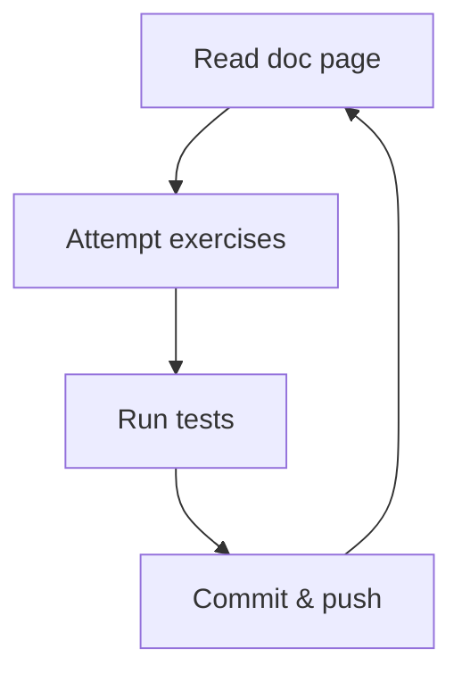

<p align="center">
  
</p>

# Hackulator

Welcome to the most hilariously broken calculator on the internet.

Bugs... bugs everywhere!

## Getting started

1. Make sure your machine is set up according to the instructions with node, npm
   and git.

1. Clone the repository (i.e. download it), so you have a copy on your machine.

1. Once cloned, open a terminal in the project root folder, and run

   ```bash
   npm install
   ```

   to get the dependencies.

   You should see some output in the terminal saying the packages have been
   audited. If you've got this far, great! You're on track.

> [!NOTE]
>
> If you see a message about "vulnerabilities", don't worry. We aren't deploying
> our code. This is something we'll talk about later.

1. Get started with the deep dive below and happy learning!

## Workflow

Make sure to commit and push often - keeping commits small is one of the best
ways to keep your project well-organised.



## Deep dive

We'd recommend squashing the bugs in the following order:

1. [add.js](/src/add.js)

1. [subtract.js](/src/subtract.js)

1. [multiply.js](/src/multiply.js)

1. [divide.js](/src/divide.js)

1. [average.js](/src/average.js)

1. [power.js](/src/power.js)

1. [remainder.js](/src/remainder.js)

1. [maxOfThree.js](/src/maxOfThree.js)

1. [heron.js](/src/heron.js)

1. [gcd.js](/src/gcd.js)
